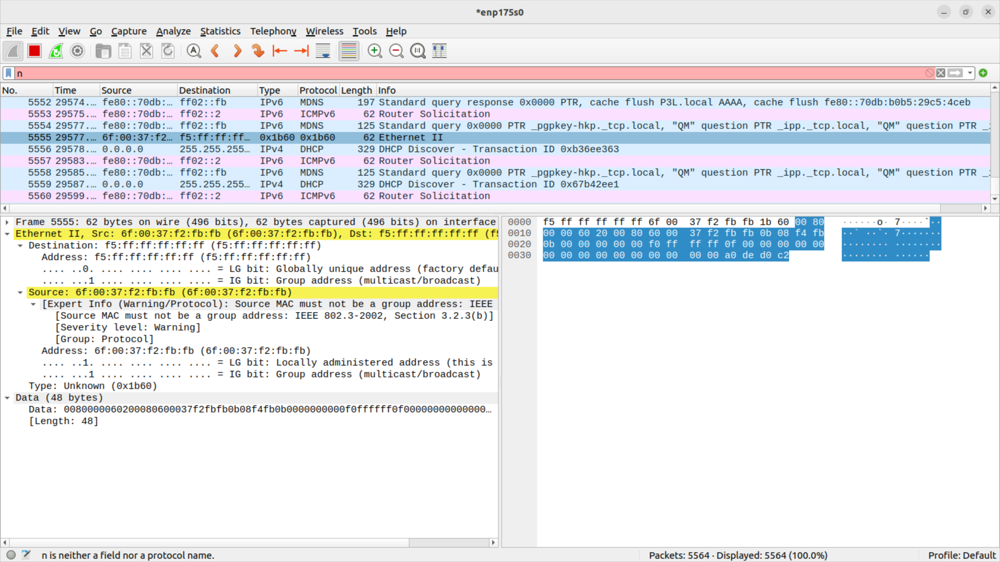

# Debugging Notes 1

**This is being tested with RGMII mode and a link established at 10M/Full.**

First packet transmitted!

This packet was received with a CRC error and a length error, per the counters
in my Ubuntu 22 LTS.



`f5ffffffffff6f0037f2fbfb1b600080000060200080600037f2fbfb0b08f4fb0b0000000000f0ffffff0f000000000000000000000000000000a0ded0c2`

Here is what was received:
```
f5 ff ff ff ff ff
6f 00 37 f2 fb fb
1b 60 
00 80
00 00 
60
20
00 80
60 00 37 f2 fb fb
0b 08 f4 fb
0b 00 00 00 00 00
f0 ff ff ff 
0f 00 00 00 00 00 00 00 
00 00 00 00 00 00 00 00
a0 de d0 c2
```

Here's what we were trying to send:
```
ff ff ff ff ff ff
06 e0 4c DF DF DF
08 06
00 01
00 00
06
04
00 01
06 e0 4c DF DF DF
10 20 DF DF
00 00 00 00 00 00
ff ff ff ff
00 00 00 00 00 00 00 00
00 00 00 00 00 00 00 00
75 0B 4B 43 (or maybe it's the other way around)
```

Some conclusions:
* It got the correct number of bytes
* It looks like both the nibbles AND the bit order may be wrong
  * FB = 1111_1011
  * DF = 1101_1111
  * 20 = 0010_0000
  * 04 = 0000_0100
* Looks like some of the bits aren't transmitted/received correctly

# Packet 2

Reversed the order in the bits for each nibble. Received this:

```
d5 ff ff ff ff ff 
7f 03 70 a6 ef ef 
6f 04 
03 80 
00 00 
00
03
02 80
00 03 70 a6 ef ef
6f 08 90 ef
6f 00 00 00 00 00 
80 ff ff ff 
7f 00 00 00 00 00 00 00
00 00 00 00 00 00 00 00 
80 ba 85 a5 
a1
```

It doesn't even receive ANYTHING at 100/full.

This looks even worse. It might be off by a single bit? Let me delay the clock 90⁰.
The problem is the PLL won't lock below 5MHz! Oy.

* Also, note Register 20 bit 1 will add a delay to GTX_CLK for TXD outputs.
  * Will require software reset after.

I used a 5MHz 90⁰ phase shift PLL, which shows locked, but it didn't help.
The received data is identical (and still very wrong).
(And it doesn't lock on the 25MHz.)
* I also specified a clock constraint:
  * `create_clock -period 400.000ns [get_ports ENET1_RX_CLK]`
  * This creates a lot of (Correct) warnings:
    * Warning (332056): PLL cross checking found inconsistent PLL clock settings:
    * Warning (332056): Clock: pll_5mhz_90_inst|altpll_component|auto_generated|pll1|clk[0] with master clock period: 400.000 found on PLL node: pll_5mhz_90_inst|altpll_component|auto_generated|pll1|clk[0] does not match the master clock period requirement: 200.000


Using `Assignment Editor` I changed `ENET1_RX_CLK` from `I/O Standard` to `Global Signal`
and `2.5V` to `Global Clock`.
* Fitter -> Resource Section -> Resource Usage Summary shows clocks used

So let's reverse the order of the transmitted nibbles...

# Packet 3

* FD = 1111_1101
* D = 1101
* E = 1110

Desired this: (same as above)
```
ff ff ff ff ff ff
06 e0 4c DF DF DF  0000_0110 1110_0000 0010_1100 1101_1111 1101_1111 1101_1111
08 06
00 01
00 00
06
04
00 01
06 e0 4c DF DF DF
10 20 DF DF
00 00 00 00 00 00
ff ff ff ff
00 00 00 00 00 00 00 00
00 00 00 00 00 00 00 00
75 0B 4B 43
```

Received this:
```
fd ff ff ff ff ff 
07 73 20 ee ef ef    0000_0111 0111_0011 0001_0000 1110_1110 1110_1111 1110_1111
07 04 
03 80
00 00 
00 
03
02 80 
00 73 20 ee ef ef
0f 10 e8 ef
07 00 00 00 00 00
f8 ff ff ff
07 00 00 00 00 00 00 00 
00 00 00 00 00 00 00 00 
b8 82 a5 a5
```

Compare these two lines
```
06 e0 4c DF DF DF  000001101110000000101100110111111101111111011111
07 73 20 ee ef ef  000001110111001100010000111011101110111111101111
```

I have no idea. Could it be a clocking issue?
* Create our own 2.5MHz clock from the system 50 clock with a PLL
  * Add at least a 12ns delay to the GTX_CLK - see Marvell 4.10.4
* Set the Register 20.1 and don't use the PLL shifted TX